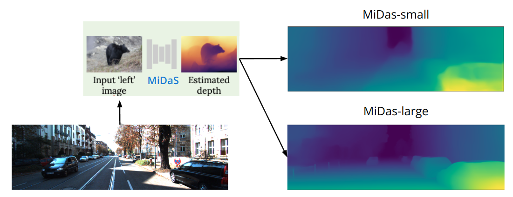
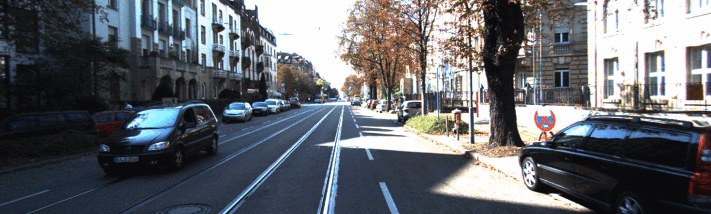

# Stereo-from-Monocular-Image
This repository ia a final project for 3D Computer Vision course in 2022 fall semester at National Taiwan University.

## Description
In this projct, we surveyed some previous works and proposed our method to generate stereo images from sequential monocular images. The synthesized stereo images can be used to run SLAM which provided rotation error closed to the error of original stereo image and better than that of monocular.

## Image to Depth
Due to limitation of CPU RAM size and the ability of GPU, this project use MiDaS-Small instead of MiDaS-Large which is a more accurate pretrained model. Then, attached MiDaS-Small with a self-built CNN model to generate depth.

## Image Warpping
Before warpping the images, we first processed the depth to perform an additional unlinear transform. After the preocessing, we combine Bilinear Interpolation and Backgoud Filling to warp the images.

(Groudtruth stereo image)

(Synthesized stereo image w/o processing)

(Synthesized stereo image w/ processing)
